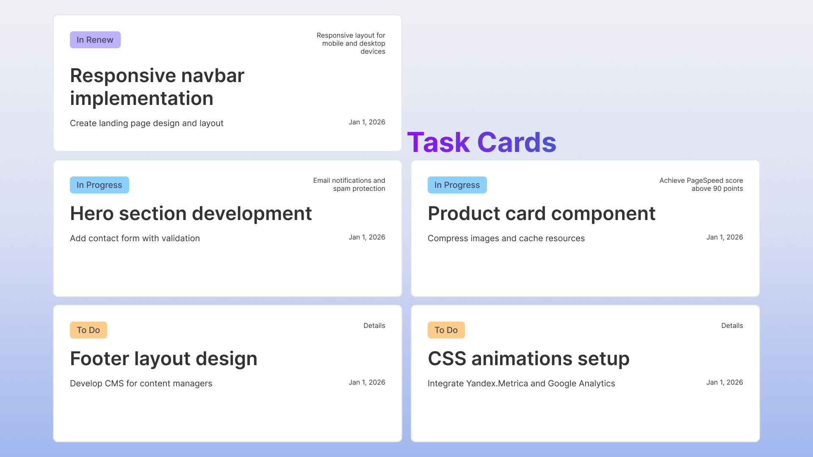
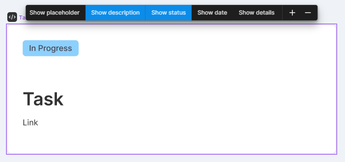
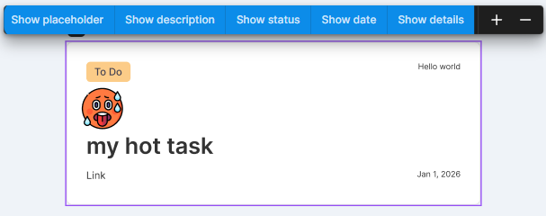
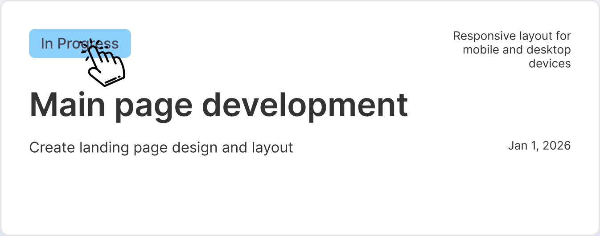

# Виджет «Карточки задач»
Настраиваемые карточки управления задачами в Figma



## Возможности
- 🔄 Динамическое добавление/удаление карточек с помощью всплывающего меню

- ⚙️ Переключение видимости всех элементов кроме заголовка (статус, детали, описание, дата)

- 🎨 Динамическое управление статусом задач. Цветовая индикация статусов (To do → In Progress → In Review → Done)

- 📝 Редактируемые поля заголовка, описания, деталей и даты

## Установка
### В Figma
1. Найдите виджет с помощью поиска: Меню "Widgets" → "Plugins & Widgets"
2. Добавьте в свой проект

### Вручную
1. Клонируйте репозиторий
2. Установите зависимости: `npm install`
3. Соберите виджет: `npm run build`
4. Импортируйте в Figma: Меню "Widgets" → "Development" → "Import from manifest"

## Разработка
```bash
npm run watch
npm run build
```

## Tech Stack
- TypeScript
- Figma Widget API

